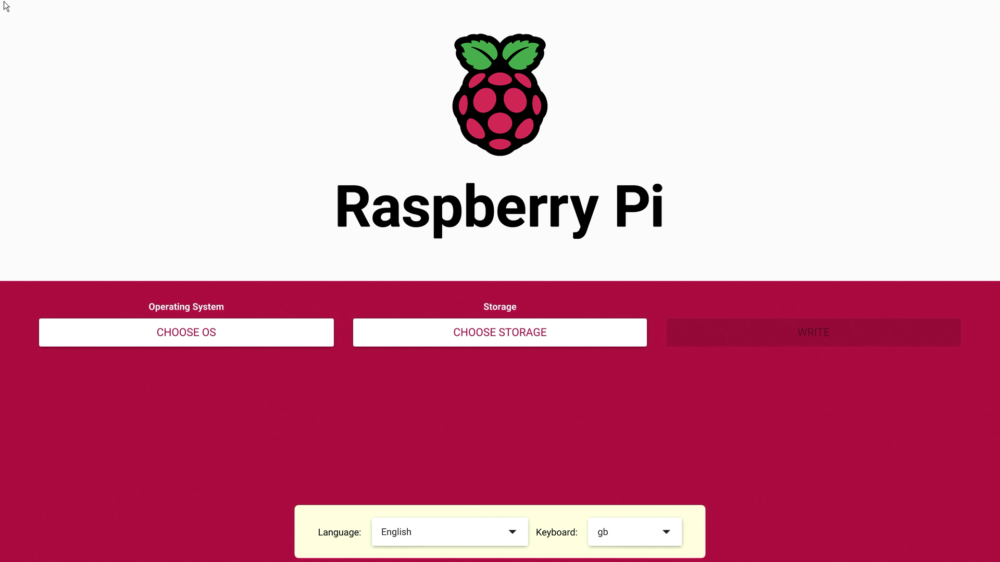
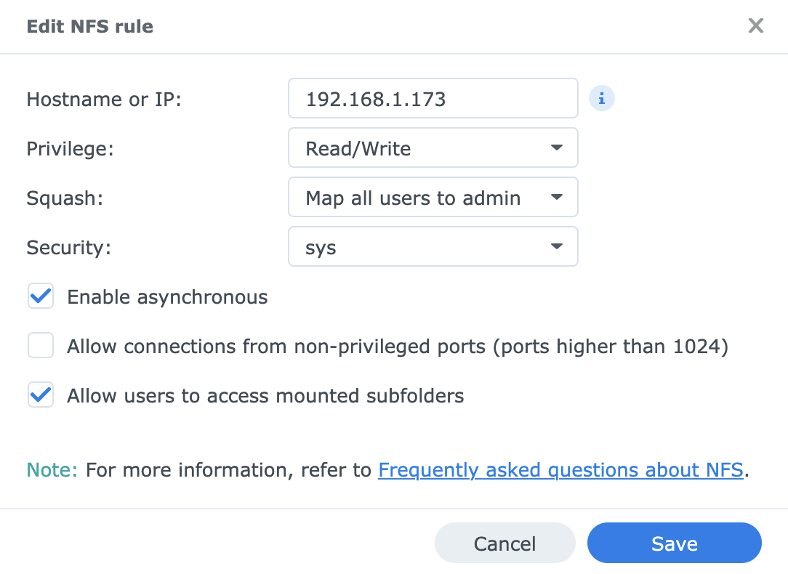

# Paperless-Raspberry-Pi5

(That summary is being writting)

Installation of the OpenSource EDM [Paperless-ngx](https://docs.paperless-ngx.com/) on a Rasoberry Pi5 with Docker.

That summary will show you how to

* Install the raspberry
* install Docker
* install Paperless-ngx
* backup your Paperless documents to a remote Synology NAS
* install and configure Samba


I assume 
* you have a minimum experience with Raspberry and command lines.
* you feel confortable to assemble [the SSD M.2 hat and the cooler](https://www.raspberrypi.com/documentation/accessories/m2-hat-plus.html#installation)
* you feel confortable to install the [Raspberry OS](https://www.raspberrypi.com/documentation/computers/os.html#introduction) and [configure it](https://www.raspberrypi.com/documentation/computers/configuration.html#raspi-config) with command line

Note: I do not have so much experience with Docker and paperless. You might need to adapt the step according to your needs. Feel free to suggest corrections and improvements. 

## Materals

This exercise have been done on a MacBook Pro M4 and with a Synology DS220+

* [Raspberry Pi5 16G](https://www.pi-shop.ch/raspberry-pi-5-16gb-ram)
* [Raspberry Pi Official cable Micro-HDMI to HDMI](https://www.raspberrypi.com/products/micro-hdmi-to-standard-hdmi-a-cable/) or [adaptator](https://www.pi-shop.ch/micro-hdmi-to-hdmi-adapter) with an HDMI cable
* [Raspberry Pi Active Cooler for Pi5](https://www.raspberrypi.com/products/active-cooler/) (optional)
* Keyboard and mouse (you may need a wire keyboard while you will need to hold the SHIFT key, later)
* [Raspberry Pi M.2 HAT+](https://www.raspberrypi.com/products/ssd-kit/) with a [SSD Disk](https://www.galaxus.ch/fr/s1/product/raspberry-pi-sc1440-512-go-m2-2230-ssd-52318096) ([Doc](https://www.raspberrypi.com/documentation/accessories/ssd-kit.html)) You also can choose for a [compact board](https://www.galaxus.ch/fr/s1/product/raspberry-pi-official-m2-hat-compact-has-module-electronique-62283750) version.
* [Raspberry power cable](https://www.raspberrypi.com/products/27w-power-supply/)
* A Synology NAS or similar
* [Rasberry Box](https://www.berrybase.de/dfrobot-aluminiumgehaeuse-fuer-raspberry-pi-5-aluminiumlegierung-verstellbarer-luefter-kuehlkoerper) (Optional)

## Usefull commands
```
docker compose exec webserver document_exporter ../export -fpz
docker compose exec webserver document_importer ../export/export-2026-01-20.zip
docker compose up -d
sudo find ~/ -type f -name "export*"
sudo nano /etc/fstab
systemctl daemon-reload
getent group |grep docker
sudo mount -t cifs -o username=user,password=yourpassword,domain=WORKGROUP //192.168.1.114/paperless /home/pierrot/paperless-ngx/export/
unzip export-2026-01-19.zip -d export-2026-01-19
```

## Installation of the Raspberry

After you have assembled the SSD hat onto the Raspberry Pi, connect an Ethernet cable from your home router to the Ethernet port of your Raspberry Pi5. Connect a keyboard and an Micro-HDMI cable to a monitor (HDMI). Power on your Raspberry Pi and hold down the Shift key (you may need a wire keyboard).



On the next window (white and purple, you will be asked to [select](https://www.raspberrypi.com/documentation/computers/getting-started.html#step-2-configure-the-fundamentals) you board, the OS and the storage devise. Select

* Raspberry Pi devise: Raspberry Pi5
* Operating system: Raspberry Pi OS (64-bit)
* Storage: Select the SSD drive (you may have one option SAMSUNG MZ9LQ...)
* Select a language and your keyboard language

You can personalize your OS which is very usefull, but I notice with Pi OS (64-bit), the setting are not saved and you will be asked to do that at the end.
(In progress)

When the installation is completed, with the keyboard and mouse connect at the Raspberry, open a terminal and enter. When you will propted

Country
* Country: Select your location
* Language: select your language
* Time zone: Select your time zone

Create user:
* Enter username: Choose an username
* password: Choose a password and confirm it

select WiFi Network
* Choose your WiFi

When the update are done, open a terminal and

```
sudo raspi-config
```
select 

* 3 Interface Option
* I1 SSH
* Choose YES

Then 
* 1 System option
* S4 hostname
* Give an host name

When it ask you to reboot, say YES

From that point, all other steps can be performed from your MacBook terminal

Connect to your raspberry
```
ssh pierrot@hostname.local
```
and run the following commands

```
sudo apt update && sudo apt upgrade
sudo apt full-upgrade
sudo rpi-eeprom-update
```


If you see a date earlier than December 6, 2023, run the following command to open the Raspberry Pi Configuration CLI:

```
sudo raspi-config
```
Under Advanced Options > Bootloader Version, choose Latest. Then, exit raspi-config with Finish or the Escape key.

Run the following command to update your firmware to the latest version:
```
sudo rpi-eeprom-update -a
```
Then, reboot with sudo reboot.


## Miscellaneous
On your Internet Box (home router), I recommend reserving the IP address assigned by your router (DHCP) for your Raspberry Pi, according to its MAC address. In that way, your Raspberry will always have the same IP address.

All steps bellow are done with command lines. So, you will need to be connect to your Raspberry with `ssh usernanem@hostname.local` from the terminal of your Macbook...

As you connected a monitor, and keyboard and a mouse to your Rasoberry, you can perform the following steps from the terminal of your Raspberry, as well.


## Docker
```
sudo apt install apt-transport-https ca-certificates curl gpg
```

Add Docker’s GPG Repo Key
```
curl -fsSL https://download.docker.com/linux/debian/gpg | sudo gpg --dearmor -o /usr/share/keyrings/docker.gpg
```

Add Docker Repository
```
echo "deb [arch=$(dpkg --print-architecture) signed-by=/usr/share/keyrings/docker.gpg] https://download.docker.com/linux/debian trixie stable" | sudo tee /etc/apt/sources.list.d/docker.list > /dev/null
```

### Check

If you enter `sudo apt update` you should be able to read

> Atteint : 2 https://download.docker.com/linux/debian trixie InRelease


If you enter
```
apt-cache policy | grep docker
```

You should read
> 500 https://download.docker.com/linux/debian trixie/stable arm64 Packages
     origin download.docker.com


### Install docker
```
sudo apt install docker-ce docker-ce-cli containerd.io docker-buildx-plugin docker-compose-plugin
```

That’s all. Docker should now be installed; the service should be started and enabled to run automatically on boot by default. Let’s verify.

```
sudo systemctl is-active docker
```

You should read 

> active


Add the user to the docker group
```
sudo adduser pierrot docker
# Check
getent group|grep docker
```

then disconnect with `exit` and reconnect with `ssh username@hostname.local` and the check docker
```
docker ps
```

## Install Paperless-ngx

```
bash -c "$(curl --location --silent --show-error https://raw.githubusercontent.com/paperless-ngx/paperless-ngx/main/install-paperless-ngx.sh)"
```

During the installation, you will be asked to give some information
* URL: I want to access from any where, then I entered an URL like http://myged.mydomain.ch . If you do not want, leave it empty
* Port [8000]: press enter to keep the default option
* Current time zone [Europe/Zurich]: press enteer to keep the default option
* Database backend (postgres sqlite mariadb) [postgres]: press enteer to keep the default option
* Enable Apache Tika? (yes no) [no]: press enteer to keep the default option
* OCR language [eng]: fra (I chose fra for french)
* User ID [1000]: press enteer to keep the default option
* Group ID [1000]: press enteer to keep the default option
* Target folder [/home/pierrot/paperless-ngx]: That fine for me, I pressed enter
* Consume folder [/home/pierrot/paperless-ngx/consume]: press enteer to keep the default option
* Media folder []:/home/pierrot/paperless-ngx/media
* Data folder []: /home/pierrot/paperless-ngx/data
* Database folder []: /home/pierrot/paperless-ngx/db
* Paperless username [pierrot]: choose an username or keep the default option
* Paperless password: Choose a password
* Email [pierrot@localhost]: give a e-mail

and then press a key to install

If you want to access it from any where, you will need an URL for your raspberry as DynDNS. From my home router, I also needed to forward the port 8080 to the port 8000 of my Raspberry to access Paperless with the following URL 

> http://myged.mydomain.ch:8080

(In the near future, it would be better to configure https://)


### Very usefull configuration
By default, all documents are stored in paperless-ngx/media/document/original/ from 00000001.pdf to 000000x.pdf.
It's much more useful to customize the folder structure/tree so that if you no longer wish to use Paperless, you can keep your documents in a readable and reusable structure.

go to
```
cd ~/paperless-ngx
```
or edit the file
```
sudo nano docker-compose.env
```
and add the line at the bottom

```
PAPERLESS_FILENAME_FORMAT={{correspondent}}/{{created_year}}/{{document_type}}/{{title}}
```

You can find other placeholders here : https://docs.paperless-ngx.com/advanced_usage/#file-name-handling if you prefer to have another tree.

Then run the command (you can run it after you have configured the backup, bellow)
```
docker compose up -d
```

From this point, by default, all new documents with me saved /compagny/year/document_type/title.

From the Paperless admin page, You can create additional [storage paths](https://docs.paperless-ngx.com/advanced_usage/#storage-paths), if you need to specify different path/tree.


## Backup/restaure on a Synology NFS Share drive

I want to weekly backup all my documents and the paperless configuration file to an external devise.

### Preparation

On your Synology NAS you will need to
* Create a share folder (I named it 'paperless')
* Go to NFS permission tab and give the IP address of your Raspberry and follow the steps below




On the Raspberry, you need to configure NFS

```
sudo apt-get install nfs-kernel-server nfs-common
```

edit paperless-ngx/docker-compose.xml and change the line
```
#- ./export:/usr/src/paperless/export
- export:/usr/src/paperless/export
```

and add the line starting with export, bellow the line redisdata 
```
volumes:
  redisdata:
  export:
    driver: local
    driver_opts:
      type: "nfs"
      o: "addr=192.168.1.114,rw" # Change with your IP address
      device: ":/volume1/paperless" # Change with the path to your share
```

when it's done, you have to run the command

```
cd ~/paperless-ngx
docker compose up -d
```

#### Investigation: 

if I run

```
sudo -s
mount -l | grep volume1
ls -la /var/lib/docker/volumes/paperless_export/_data
```
all my exports are listed, but `cd ~/paperless-ngx && ls -la export` does not. I do not understand why, at the moment.

### Backup

If you want to run manuelly the backup, go the paperless directory and run the command
```
cd paperless-ngx
docker compose exec webserver document_exporter ../export -fpz
```

If you have changed the default storage tree
```
PAPERLESS_FILENAME_FORMAT={{correspondent}}/{{created_year}}/{{document_type}}/{{title}}
```
the zip file contains in `media/documents/originals` all of your files.

You will find all your files correctly structured so that you can locate them in your desired format. The advantage is that if you no longer wish to use Paperless, you can continue working with this structure on your computer.

#### Backup with cron

```
crontab -e
```
(in progress)


### Restaure

If I need to restaure a file, I would extract the zip file and get back the missing file(s)

With the following command, I restored two exports with two different storage paths (I do not why). Some existing files have been replaced but I observed that both structure (storage paths) have been restored (not good).

```
docker compose exec webserver document_importer ../export/export-2026-01-20.zip
```

If I need to restore more several files, I would prefer to reinstall my Raspberry following the steps above (30mn) and import all of my files with the following command. Opt to you.

I tried and it works fine!


## Install Samba
Paperless let you to copy/past or move a pdf file into folder called 'consume'. After you past your pdf file, Paperless will automatically detect it and create a new record. You will just need to finalized the entry according to the document type, correspondant and tags. A special tag will be assigned to the new entry because you desifned that tag for all new imported document.


As I can not easly send a file from my MacBook to the folder 'consume' of my Rasoberry, on my Raspberry Pi5, I configured Samba to be able to mount the Samba share to my MacBook. In that way, from my MacBook, I am able to move or copy/past a pdf file, I want to import to Paperless, on my Raspberry Pi5. 

```
sudo apt install samba samba-common-bin
```
### Configuration

```
sudo nano /etc/samba/smb.conf
```

Add the following

```
[consume-ngx]
path = /home/pierrot/paperless-ngx/consume # Change the username (pierrot) according to yours
writeable = yes
browseable = yes
public = no
```

Add a Samba user
```
sudo smbpasswd -a pierrot # Change the username (pierrot) according to yours
```

Restart Samba
```
sudo systemctl restart smbd
```


